# MyClinic

This web application is a full-stack solution designed to simplify the process of booking and managing appointments for both patients and doctors. Whether you're a patient looking to schedule an appointment with a healthcare professional or a doctor managing your appointment schedule, our comprehensive platform has you covered.

## Features
Patients -
- __Appointment Dashboard :__ View upcoming appointments on a calender colour-coded as Completed(green), Cancelled(Red) or Scheduled(Blue).
- __Book Appointments :__ Easily browse and select from a list of available doctors and dates/times to book your next appointment.
- __View Upcoming and Past Appointments :__ Keep track of your appointments by accessing your upcoming and past appointments.
- __Search for Doctors :__ Find the right healthcare provider based on your specific needs from the search page.
- __Profile Page :__ Maintain your personal information and medical history for seamless appointments.

Doctors -
- __Appointment Dashboard :__ View upcoming appointments on a calender colour-coded as Completed(green), Cancelled(Red) or Scheduled(Blue).
- __Book Appointments for Patients :__ Doctors have the capability to schedule appointments on behalf of their patients, providing a seamless experience for both healthcare providers and their clientele.
- __Manage Appointments :__ Efficiently organize your schedule by viewing upcoming appointments, marking them as completed or cancelling them.
- __Profile Management :__ Maintain your professional details, contact information, and practice information to ensure patients can easily find and connect with you.

## Tech Stack
### Frontend
- `react` for building interactive UIs
- `react-dom` for rendering the UI
- `react-router` for page navigation
- Styling
  - `bootstrap` for providing responsive stylesheets
  - `react-bootstrap` for providing components built on top of Bootstrap CSS without using plugins
  - `fort-awesome` for displaying icons
  - `react-lottie` for rendering lottie animations
  - `full-calender` for showing calender on dashboard
- State management and backend integration
  - `axios` for performing asynchronous calls
- Utilities
  -  `crypto-js` for hashing passwords while storing in backend

### Backend
- `django` for building backend logic using Python
- `djangorestframework` for building a REST API on top of Django
- `django-cors-headers` for handling the server headers required for Cross-Origin Resource Sharing (CORS)
- `psycopg2` for using PostgreSQL database

## Pages
### Login - Signup
  

    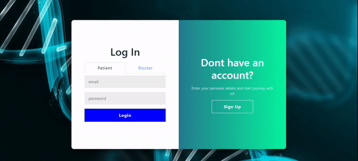
  

### Dashboard (Calender + Upcoming Appointments)

  - Patient -
    

      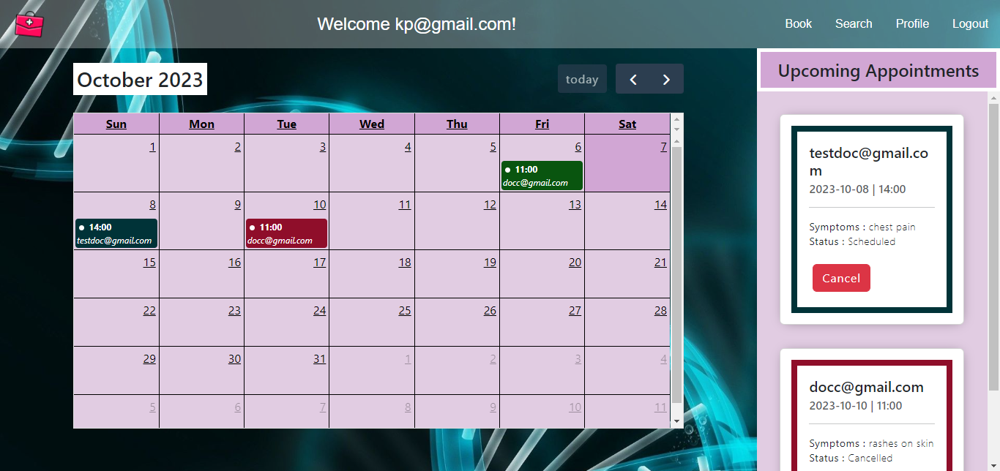
    

  - Doctor -
    

      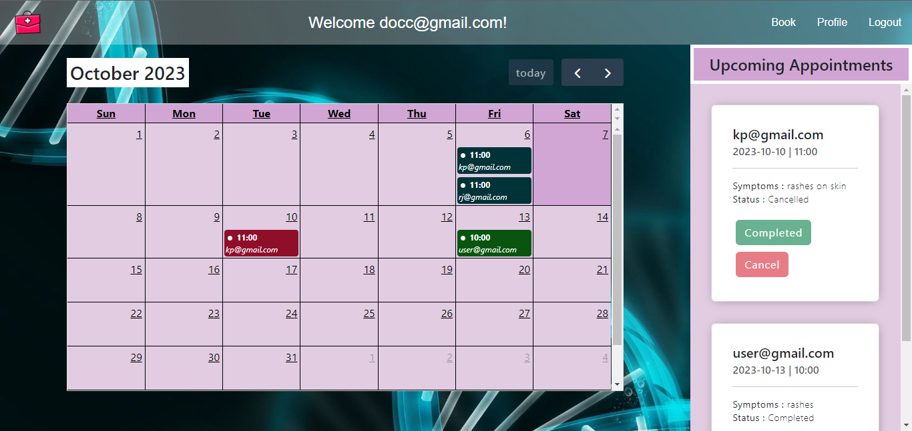
    

### Booking Page

  - Patient -
    

      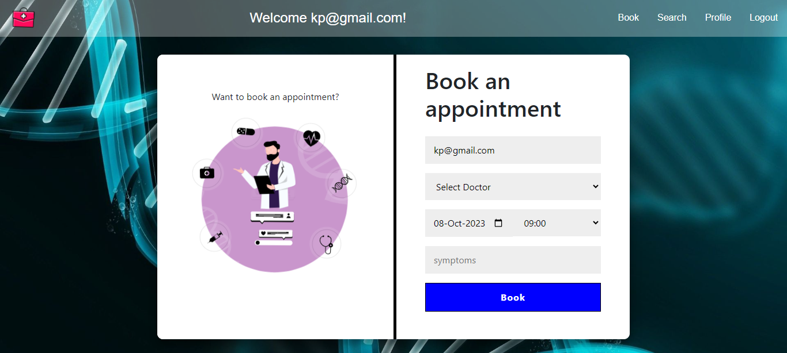
    

  - Doctor -
    

      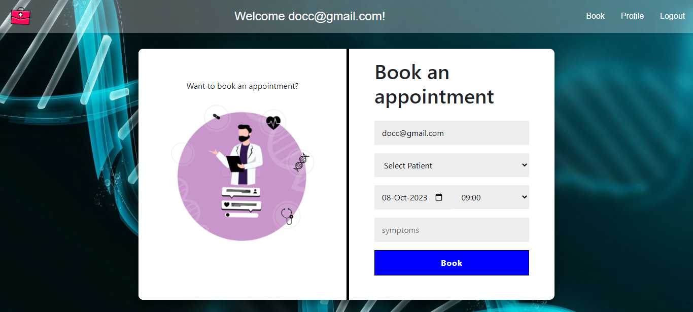
    

### Profile Page

  - Patient -
    

      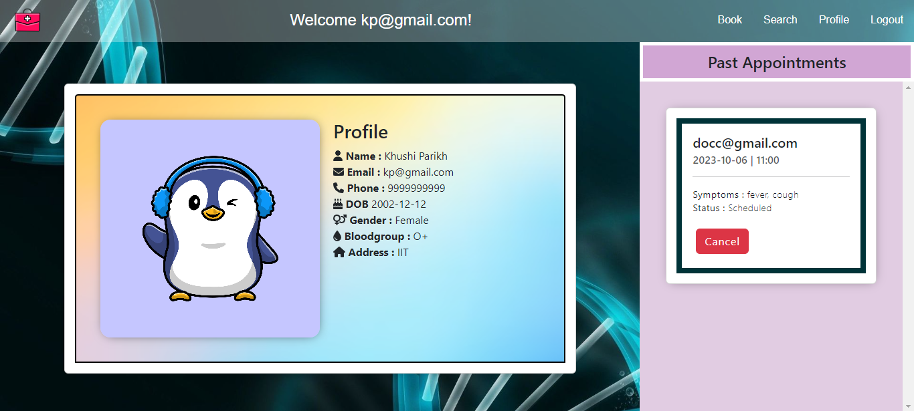
    

  - Doctor -
    

      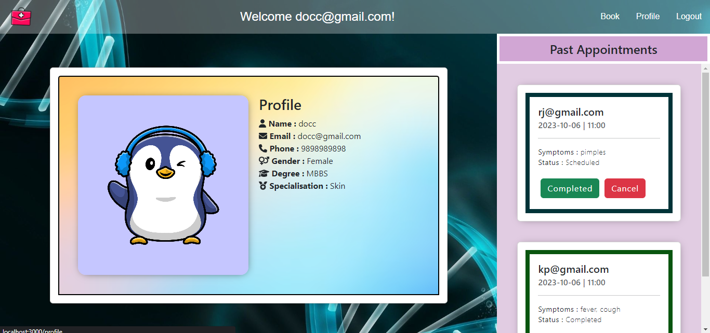
    

- Search Page
    

      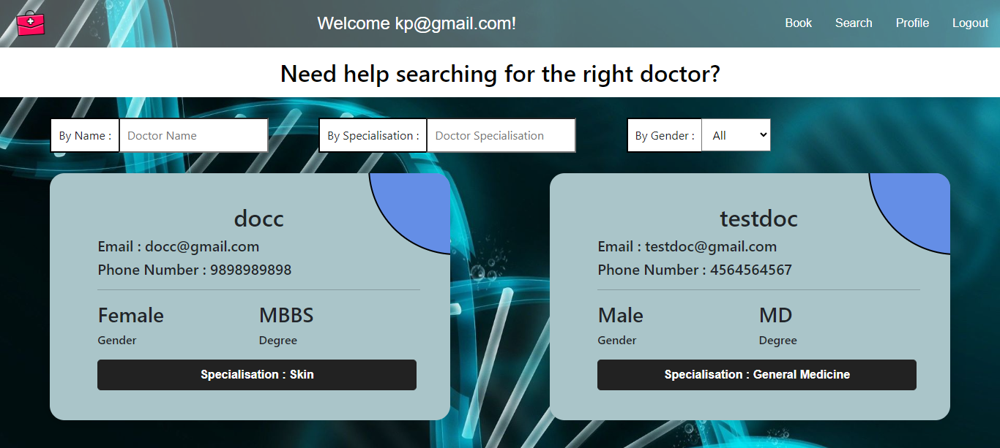
    

## Functionalities

- Booking an Appointment  
  This can be done by both a doctor an a patient. Their email comes pre-filled and they can book appointments from the next day onwards.
  

    
  

- Searching for the right Doctor  
  A list of doctors with their details are provided to the patient.
  

    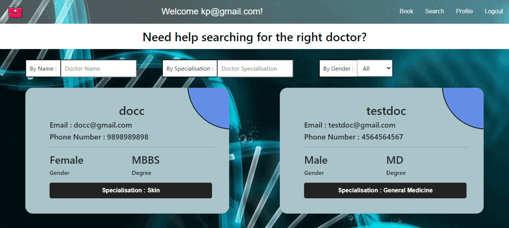
  

- Cancelling an appointment  
  This can be done by both the patient and the doctor.
  

    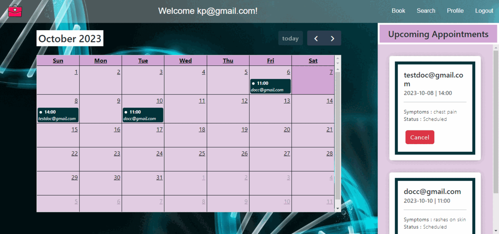
  

- Completing an appointment  
  When the doctor finishes the appointment, he marks it as completed.
  

    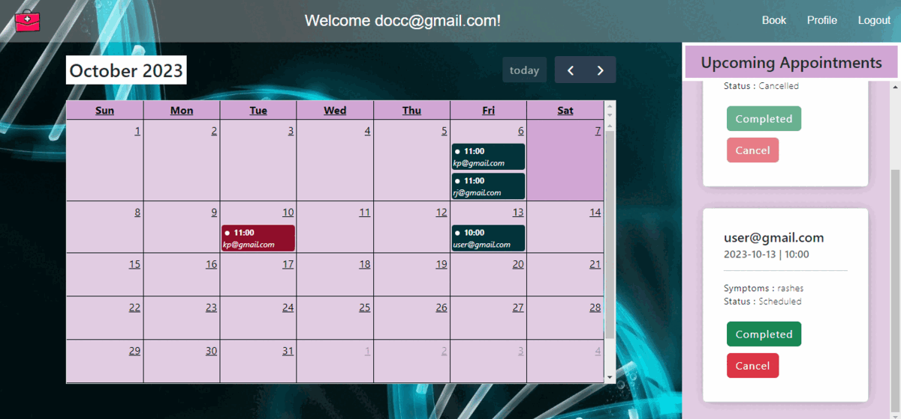
  

## Authors
- [Rhythm Jain](https://www.github.com/rhythm426)
- [Khushi Parikh](https://www.github.com/khushi-parikh)

